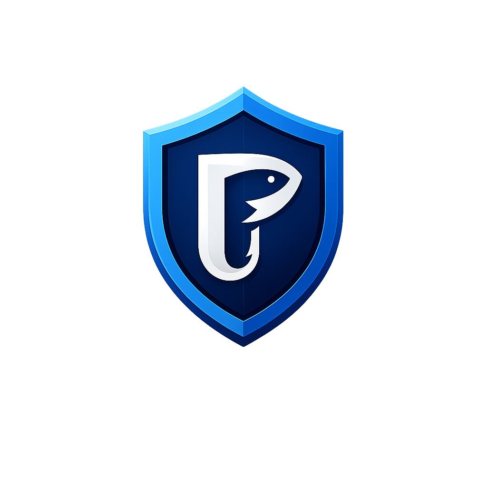

<p align="center">
  
</p>

<h1 align="center">🛡️ PhishGuard 🛡️</h1>

<p align="center">
  <strong>Plataforma SECaaS B2B com Hub de Convergência Conversacional</strong>
</p>

<p align="center">
  <a href="https://github.com/eduardoicosta/PhishGuard"></a>
  
  
  
</p>

<p align="center">
  
  
  
  
  
  
</p>

---

## 🎓 Integrantes (FIAP Startup One)
* **Arthur Dias da Silva Biancchi** – RM 99162
* **Eduardo Costa Nascimento dos Anjos** – RM 552519
* **Enzo Puerta Meschini** – RM 550807

**Curso:** Sistemas de Informação - FIAP (2026)  
**Projeto de Conclusão de Curso (TCC):** FIAP Startup One

---

## 🎯 1. Sobre o Projeto (O Pivô Estratégico)

O **PhishGuard** passou por um completo e maduro **pivô estratégico de arquitetura**. O que nasceu inicialmente como uma ferramenta desktop monolítica local de triagem de e-mails evoluiu para um ecossistema integrado de **SECaaS (Security as a Service) B2B**. 

Nossa missão é blindar empresas contra ataques de phishing de **"dia zero"** (zero-day) e de engenharia social avançada, interceptando ameaças antes que elas causem vazamentos de dados ou prejuízos financeiros. Fazemos isso por meio de uma abordagem de **defesa híbrida de dupla camada baseada em IA**:

*   **Camada 1 (Estatística e Alta Performance):** Modelos de Machine Learning supervisionados (*Random Forest* + *XGBoost*) que analisam a estrutura gramatical e vetores gramaticais do texto para gerar um score preditivo instantâneo.
*   **Camada 2 (Cognitiva e Contextual):** Modelos de Linguagem de Grande Porte (**LLM - Google Gemini 3.5 Flash** através da biblioteca oficial `google-genai`), que interpretam intenções dissimuladas, táticas de manipulação, senso de urgência e consistência de marcas para fornecer explicações profundas ao usuário.

Este repositório consolidado serve como o MVP tecnológico apresentado para a banca examinadora da FIAP, provando a viabilidade técnica e comercial da nossa solução.

---

## 🏗️ 2. A Arquitetura (O Hub de Convergência)

O diferencial mercadológico do **PhishGuard** é sua capacidade de atuar onde o colaborador corporativo estiver. Para isso, criamos o **Hub de Convergência Conversacional**, composto por **5 grandes pilares interconectados**:

```text
                           ┌────────────────────────┐
                           │      PAINEL SOC        │ ◄──── (Auditoria de logs)
                           └───────────┬────────────┘
                                       │ /api/logs-soc
                                       ▼
 ┌──────────────────┐      ┌────────────────────────┐      ┌──────────────────┐
 │  EXTENSÃO WEB    ├─────►│    BACKEND CENTRAL     │◄─────┤   WHATSAPP BOT   │
 │ (Emails/Chrome)  │      │ (FastAPI, ML, Gemini,  │      │ (Simulador Chat) │
 └──────────────────┘      │        SQLite)         │      └──────────────────┘
                           └───────────▲────────────┘
                                       │ /webhook/webchat
                                       ▼
                           ┌────────────────────────┐
                           │     SITE B2B WEBCHAT   │
                           └────────────────────────┘
```

### 1. Backend Central (`api.py`)
O "cérebro" unificado da plataforma. Desenvolvido em **FastAPI**, expõe endpoints assíncronos de alta performance. Ele é responsável por:
*   Carregar e executar os modelos serializados de Machine Learning (`.pkl`).
*   Gerenciar a comunicação com as APIs cognitivas do **Google Gemini** para dupla checagem contextual.
*   Persistir e auditar todas as interações e ameaças detectadas em um banco de dados nativo **SQLite** (`phishguard.db`).

### 2. Extensão Web (`extensao_chrome/`)
Uma camada de **proteção passiva** invisível ao usuário final. Trata-se de uma extensão nativa para navegadores Chromium (Google Chrome, Edge) que monitora e-mails recebidos. Ao detectar conteúdo de risco em tempo real, a extensão faz chamadas para a API e pinta de forma cromática e visual avisos de alerta diretamente sobre a caixa postal corporativa (verde para seguro, vermelho para crítico).

### 3. WhatsApp Bot (`hub_conversacional/simulador_whatsapp.html`)
Uma camada de **proteção ativa** focada em mobilidade. Consiste em uma interface que simula perfeitamente um bot corporativo do WhatsApp Business. O colaborador pode encaminhar links, mensagens de texto suspeitas ou avisos recebidos no telefone. A API processa os dados sob um conjunto de regras especializadas de cibersegurança e envia de volta um veredito direto e formatado de forma amigável para chats mobile.

### 4. Webchat & Site Comercial B2B (`site_comercial/index.html`)
O site institucional onde empresas conhecem e contratam a plataforma. Ele conta com um **Widget de Chat Conversacional Híbrido** no canto inferior direito. O bot usa inteligência adaptativa guiada por engenharia de prompts no Gemini para cumprir dois papéis cruciais:
*   **Papel de Vendas:** Responde de forma persuasiva sobre funcionalidades, diferenciais, arquitetura e propostas comerciais da nossa startup.
*   **Papel de Analista:** Se o usuário colar um link ou mensagem suspeita, o robô automaticamente assume uma postura defensiva de Analista de Segurança, acionando a análise preditiva em tempo real.

### 5. Painel SOC (`painel_soc/index.html`)
O painel de monitoramento e auditoria em tempo real voltado para o departamento de TI e CISOs (Chief Information Security Officers). Ele consome de forma transparente o banco de dados via `/api/logs-soc` e renderiza em painéis gráficos elegantes dados sobre interações realizadas, canais mais atacados (Webchat, WhatsApp, etc.), volumetria de ameaças detectadas e logs completos para auditoria forense de incidentes de segurança.

---

## 🛠️ 3. Tecnologias Utilizadas

A stack tecnológica do ecossistema foi desenhada focando em portabilidade, rapidez de resposta e acurácia preditiva:

*   **Backend & IA Core:**
    *   **Python 3.10+** (Linguagem base)
    *   **FastAPI** (Servidor de microsserviços rápido e robusto)
    *   **Uvicorn** (Servidor ASGI assíncrono para Python)
    *   **Scikit-Learn** & **XGBoost** (Pipeline matemático de classificação e treinamento de modelos de Camada 1)
    *   **Google Gemini 3.5 Flash** (Integração cognitiva de Camada 2 via biblioteca `google-genai` usando o modelo `gemini-3.5-flash`)
    *   **Joblib** (Descompressão e carga ultra-rápida de binários matemáticos)
*   **Armazenamento:**
    *   **SQLite** (Banco de dados de transações ACID embutido, perfeito para alta escalabilidade de desenvolvimento)
*   **Frontend (Interfaces de Usuário):**
    *   **HTML5 / CSS3 / JavaScript Moderno (ES6+)** (Interfaces responsivas criadas sem necessidade de frameworks pesados, garantindo carregamento instantâneo)

---

## 🚀 4. Como Rodar o Projeto (Passo a Passo)

### Pré-requisitos
*   **Python 3.10** ou superior instalado em sua máquina.
*   Navegador **Google Chrome** (ou Edge) para carregar a extensão.

---

### Passo 1: Clonar o Repositório e Criar o Ambiente Virtual

Abra um terminal na raiz de seu diretório e execute:

```bash
# Clonar o repositório
git clone https://github.com/eduardoicosta/PhishGuard.git
cd PhishGuard

# Criar ambiente virtual de isolamento (venv)
python -m venv venv

# Ativar no Windows (PowerShell)
.\venv\Scripts\Activate.ps1

# Ativar no Linux / macOS
source venv/bin/activate
```

---

### Passo 2: Instalar Dependências e Configurar Chaves

```bash
# Instalar dependências do requirements.txt
pip install -r requirements.txt
```

Crie um arquivo chamado **`.env`** na raiz do projeto (ao lado de `api.py`) e configure a sua chave de API para o Gemini:

```env
GEMINI_API_KEY=sua_chave_real_da_gemini_api_aqui
```

*(Nota: Caso você opte por rodar sem a `GEMINI_API_KEY`, o ecossistema funcionará perfeitamente em modo de contingência local, utilizando o pipeline estatístico de Machine Learning e mockando as respostas cognitivas para que a experiência do usuário não seja interrompida).*

---

### Passo 3: Inicializar o Servidor API do Backend

Com seu ambiente virtual ativo, execute o arquivo principal para levantar o servidor FastAPI:

```bash
python api.py
```

O servidor será inicializado na porta padrão `8000`. Você pode verificar que o backend está funcionando acessando:
*   API Status / Endpoint de Logs: `http://localhost:8000/api/logs-soc`
*   Documentação Interativa (Swagger UI): `http://localhost:8000/docs`

---

### Passo 4: Executar as Interfaces Web (Site, WhatsApp e SOC)

As interfaces do ecossistema foram projetadas para máxima praticidade. Elas rodam diretamente no navegador sem necessidade de um servidor web dedicado.

Basta abrir os seguintes arquivos HTML diretamente em seu navegador (dando duplo clique neles em seu explorador de arquivos ou arrastando-os para a janela do browser):

1.  **Site Comercial B2B e Webchat:** `site_comercial/index.html` (Interaja com o chat inteligente no canto inferior direito).
2.  **Simulador de WhatsApp:** `hub_conversacional/simulador_whatsapp.html` (Cole mensagens de texto ou links fraudulentos para ver o bot em ação).
3.  **Painel do SOC:** `painel_soc/index.html` (Monitore o dashboard de telemetria de segurança e veja o histórico de interações sendo populado em tempo real pelo SQLite).

---

### Passo 5: Carregar a Extensão no Google Chrome

Para testar a proteção cromática de e-mails integrada à nossa API:

1.  Abra o Google Chrome e digite **`chrome://extensions/`** na barra de endereços.
2.  No canto superior direito, ative a chave **"Modo do desenvolvedor" (Developer mode)**.
3.  No canto superior esquerdo, clique no botão **"Carregar sem compactação" (Load unpacked)**.
4.  Selecione a pasta **`extensao_chrome`** contida na raiz deste repositório clonado.
5.  A extensão se conectará de forma transparente à sua API local (`http://localhost:8000`), pronta para interceptar e marcar e-mails maliciosos no navegador de forma automática.

*(Dica técnica: Se você precisar re-treinar o modelo de machine learning estatístico clássico com novos dados, basta executar `python src/ml_engine.py` para regenerar os arquivos `.pkl` na pasta `models/`).*

---

## 💼 5. Modelo de Negócios (Startup One)

O PhishGuard foi estruturado sob o modelo de monetização de **SaaS B2B corporativo** por subscrição recorrente mensal baseada no número de colaboradores protegidos (*per seat/month*):

*   🛡️ **Plano Starter (R$ 15,00/colaborador/mês):**
    *   Extensão desktop de blindagem passiva para e-mails.
    *   Detecção estatística via Machine Learning Clássico (Camada 1).
    *   Ideal para pequenas empresas com baixa exposição a golpes simples.
*   👑 **Plano Enterprise (R$ 25,00/colaborador/mês):**
    *   Extensão desktop de blindagem passiva para e-mails.
    *   Motor estatístico Camada 1 + Dupla Checagem cognitiva profunda via Google Gemini (Camada 2).
    *   Acesso ao Hub de Convergência Conversacional (WhatsApp Bot ativo de segurança).
    *   Painel SOC de Telemetria e Governança corporativa completo para o time de SI/TI.
    *   Suporte técnico SLA 24/7.

---

<p align="center">
  <strong>PhishGuard © 2026 — Segurança contínua para o elemento humano das empresas.</strong>
</p>

